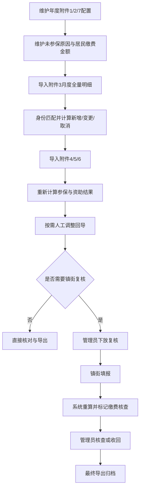
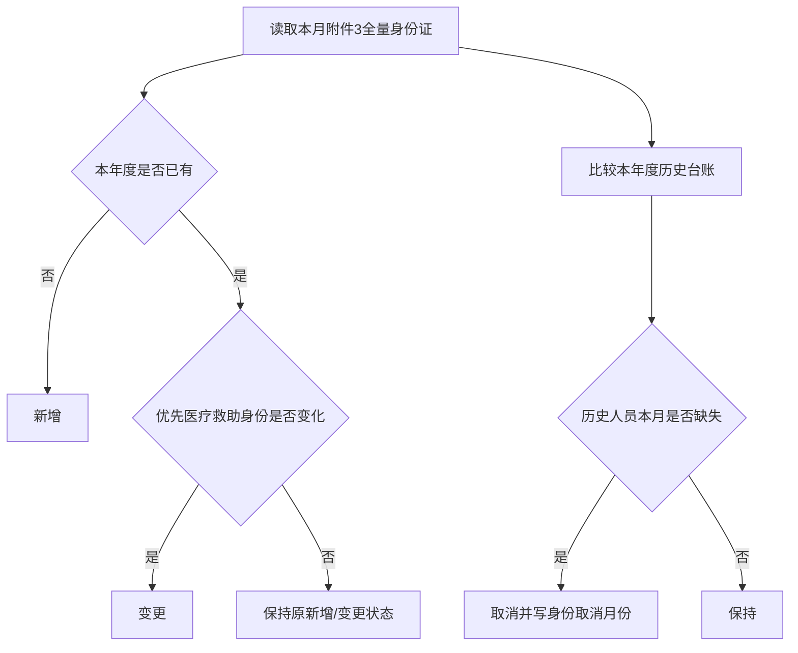
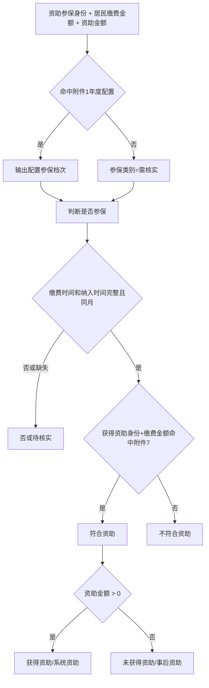
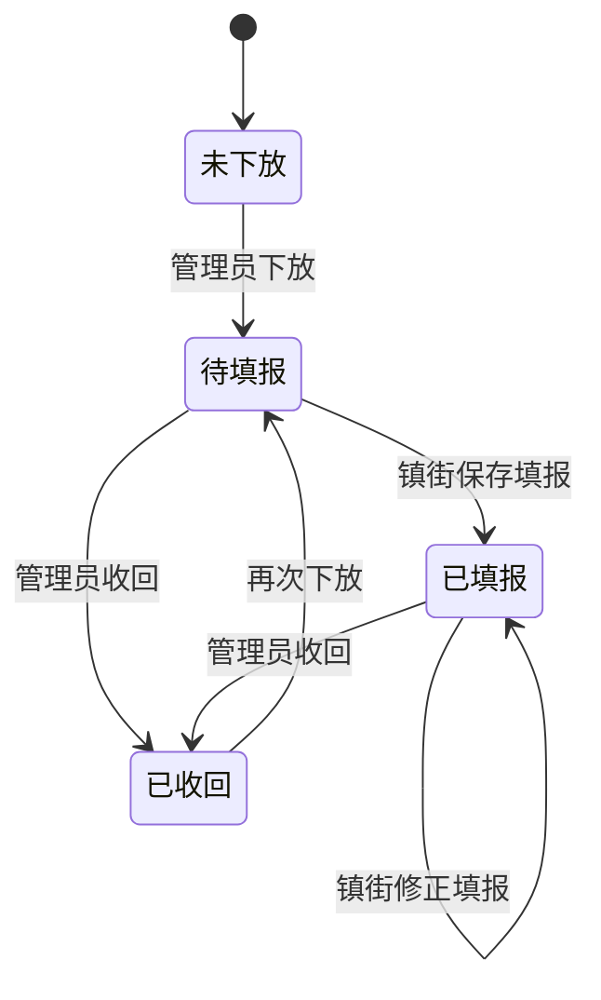
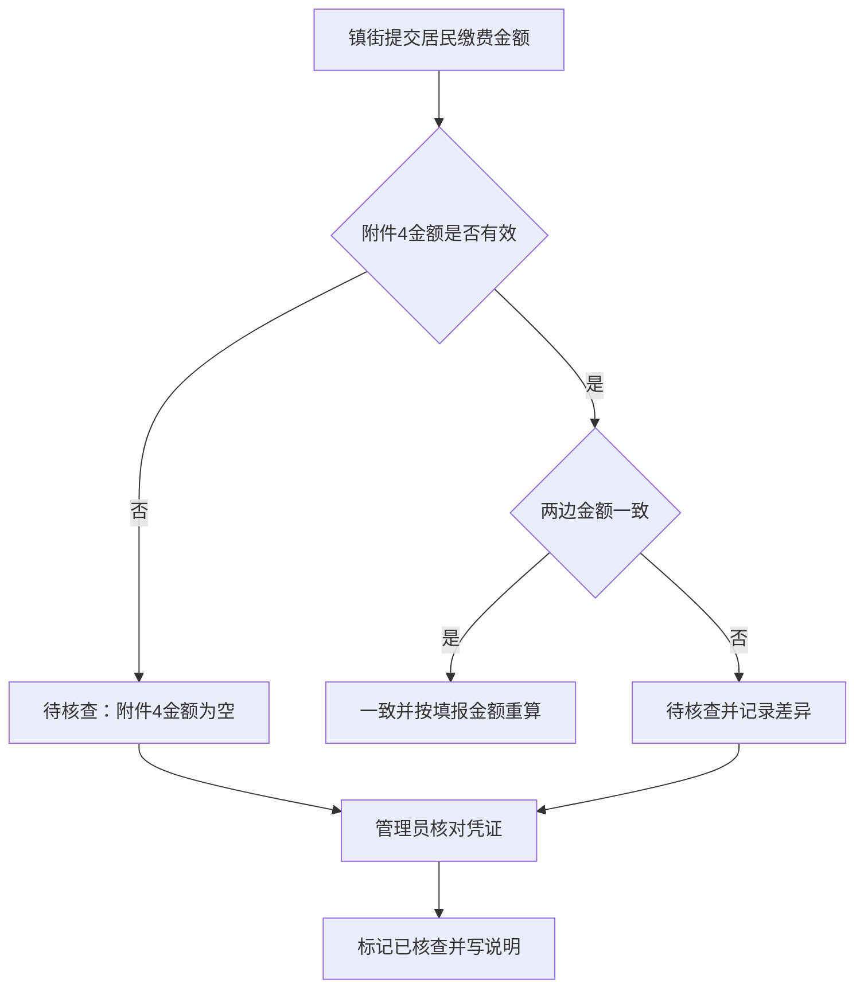

# 参保台账业务流程图解

## 总流程

```mermaid
flowchart TD
    A["维护年度附件1/2/7配置"] --> B["维护未参保原因与居民缴费金额"]
    B --> C["导入附件3月度全量明细"]
    C --> D["身份匹配并计算新增/变更/取消"]
    D --> E["导入附件4/5/6"]
    E --> F["重新计算参保与资助结果"]
    F --> G["按需人工调整回导"]
    G --> H{"是否需要镇街复核"}
    H -- "否" --> I["直接核对与导出"]
    H -- "是" --> J["管理员下放复核"]
    J --> K["镇街填报"]
    K --> L["系统重算并标记缴费核查"]
    L --> M["管理员核查或收回"]
    M --> N["最终导出归档"]
```

## 附件3身份变化

```mermaid
flowchart TD
    A["读取本月附件3全量身份证"] --> B{"本年度是否已有"}
    B -- "否" --> C["新增"]
    B -- "是" --> D{"优先医疗救助身份是否变化"}
    D -- "是" --> E["变更"]
    D -- "否" --> F["保持原新增/变更状态"]
    A --> G["比较本年度历史台账"]
    G --> H{"历史人员本月是否缺失"}
    H -- "是" --> I["取消并写身份取消月份"]
    H -- "否" --> J["保持"]
```

## 参保与资助计算

```mermaid
flowchart TD
    A["资助参保身份 + 居民缴费金额 + 资助金额"] --> B{"命中附件1年度配置"}
    B -- "是" --> C["输出配置参保档次"]
    B -- "否" --> D["参保类别=需核实"]
    C --> E["判断是否参保"]
    D --> E
    E --> F{"缴费时间和纳入时间完整且同月"}
    F -- "否或缺失" --> G["否或待核实"]
    F -- "是" --> H{"获得资助身份+缴费金额命中附件7"}
    H -- "是" --> I["符合资助"]
    H -- "否" --> J["不符合资助"]
    I --> K{"资助金额 > 0"}
    K -- "是" --> L["获得资助/系统资助"]
    K -- "否" --> M["未获得资助/事后资助"]
```

## 镇街复核状态

```mermaid
stateDiagram-v2
    [*] --> 未下放
    未下放 --> 待填报: 管理员下放
    已收回 --> 待填报: 再次下放
    待填报 --> 已填报: 镇街保存填报
    已填报 --> 已填报: 镇街修正填报
    待填报 --> 已收回: 管理员收回
    已填报 --> 已收回: 管理员收回
```

## 缴费核查

```mermaid
flowchart TD
    A["镇街提交居民缴费金额"] --> B{"附件4金额是否有效"}
    B -- "否" --> C["待核查：附件4金额为空"]
    B -- "是" --> D{"两边金额一致"}
    D -- "是" --> E["一致并按填报金额重算"]
    D -- "否" --> F["待核查并记录差异"]
    C --> G["管理员核对凭证"]
    F --> G
    G --> H["标记已核查并写说明"]
```

