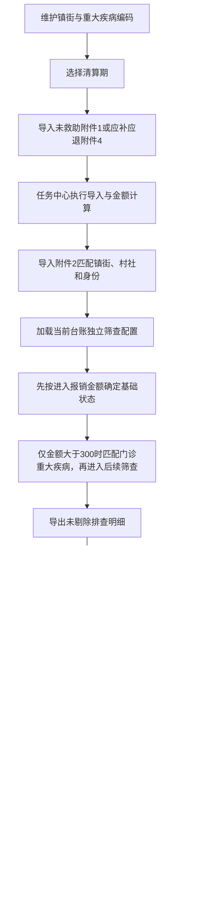
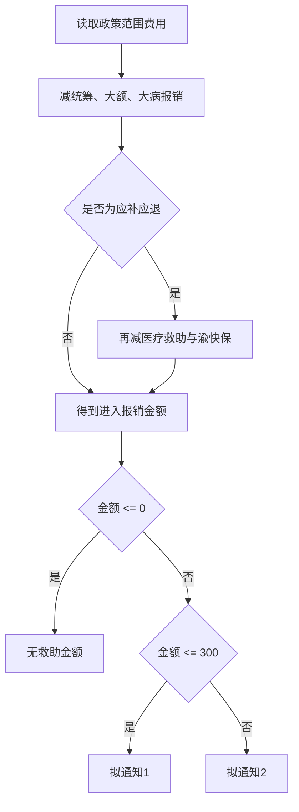
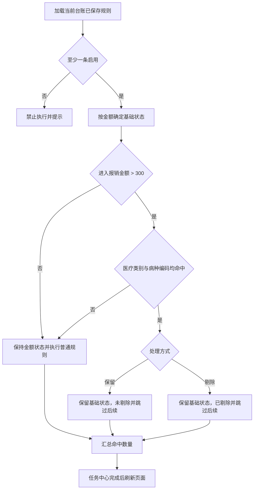
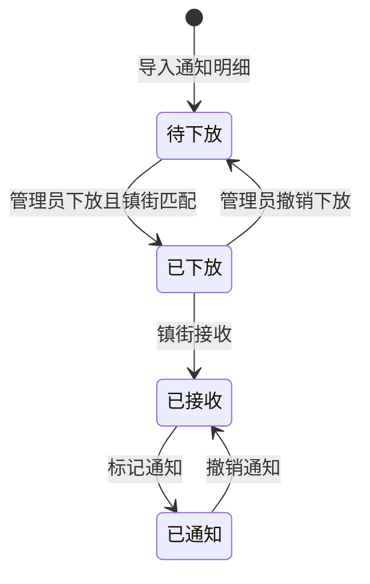

# 未救助台账业务流程图解

## 总流程

```mermaid
flowchart TD
    A["维护镇街与重大疾病编码"] --> B["选择清算期"]
    B --> C["导入未救助附件1或应补应退附件4"]
    C --> D["任务中心执行导入与金额计算"]
    D --> E["导入附件2匹配镇街、村社和身份"]
    E --> F["加载当前台账独立筛查配置"]
    F --> G["先按进入报销金额确定基础状态"]
    G --> H["仅金额大于300时匹配门诊重大疾病，再进入后续筛查"]
    H --> I["导出未剔除排查明细"]
    I --> J["线下核对"]
    J --> K{"是否需要通知"}
    K -- "否" --> L["排查归档"]
    K -- "是" --> M["导入下放通知"]
    M --> N["下放、接收、通知、反馈"]
    N --> O["报销标记与导出归档"]
```

## 金额与状态

```mermaid
flowchart TD
    A["读取政策范围费用"] --> B["减统筹、大额、大病报销"]
    B --> C{"是否为应补应退"}
    C -- "是" --> D["再减医疗救助与渝快保"]
    C -- "否" --> E["得到进入报销金额"]
    D --> E
    E --> F{"金额 <= 0"}
    F -- "是" --> G["无救助金额"]
    F -- "否" --> H{"金额 <= 300"}
    H -- "是" --> I["拟通知1"]
    H -- "否" --> J["拟通知2"]
```

## 筛查

```mermaid
flowchart TD
    A["加载当前台账已保存规则"] --> B{"至少一条启用"}
    B -- "否" --> C["禁止执行并提示"]
    B -- "是" --> D["按金额确定基础状态"]
    D --> E{"进入报销金额 > 300"}
    E -- "否" --> I["保持金额状态并执行普通规则"]
    E -- "是" --> F{"医疗类别与病种编码均命中"}
    F -- "否" --> I
    F -- "是" --> G{"处理方式"}
    G -- "保留" --> H["保留基础状态，未剔除并跳过后续"]
    G -- "剔除" --> J["保留基础状态，已剔除并跳过后续"]
    H --> K["汇总命中数量"]
    I --> K
    J --> K
    K --> L["任务中心完成后刷新页面"]
```

## 下放通知状态机

```mermaid
stateDiagram-v2
    [*] --> 待下放: 导入通知明细
    待下放 --> 已下放: 管理员下放且镇街匹配
    已下放 --> 待下放: 管理员撤销下放
    已下放 --> 已接收: 镇街接收
    已接收 --> 已通知: 标记通知
    已通知 --> 已接收: 撤销通知
```

报销状态独立于下放状态，在“未报销”和“已报销”之间切换。

## 镇街可见范围

```mermaid
flowchart LR
    A["登录账号绑定 town_id"] --> B["后端限定同一 town_id"]
    B --> C["只返回已下放/已接收/已通知相关数据"]
    C --> D["前端隐藏管理员字段与操作"]
```
