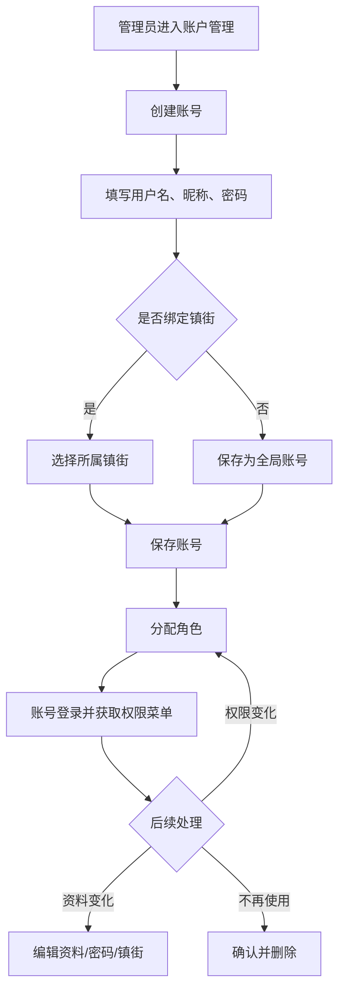
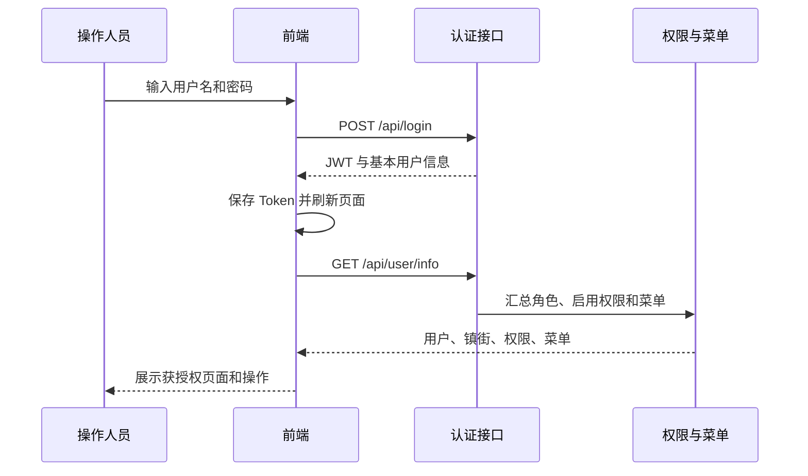
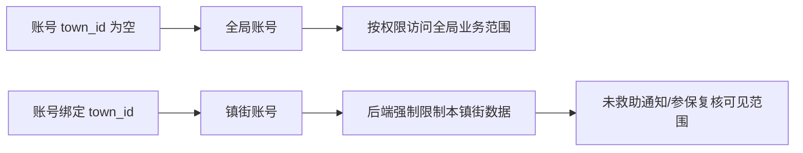
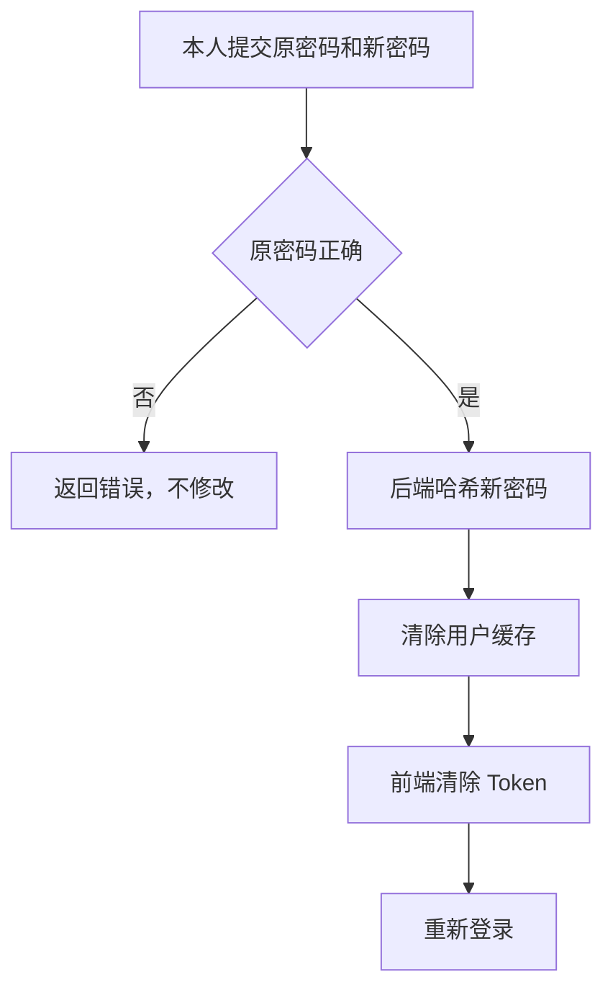

# 系统用户管理业务流程图解

## 账号生命周期

```mermaid
flowchart TD
    A["管理员进入账户管理"] --> B["创建账号"]
    B --> C["填写用户名、昵称、密码"]
    C --> D{"是否绑定镇街"}
    D -- "是" --> E["选择所属镇街"]
    D -- "否" --> F["保存为全局账号"]
    E --> G["保存账号"]
    F --> G
    G --> H["分配角色"]
    H --> I["账号登录并获取权限菜单"]
    I --> J{"后续处理"}
    J -- "资料变化" --> K["编辑资料/密码/镇街"]
    J -- "权限变化" --> H
    J -- "不再使用" --> L["确认并删除"]
```

## 登录与权限加载

```mermaid
sequenceDiagram
    participant U as 操作人员
    participant F as 前端
    participant A as 认证接口
    participant R as 权限与菜单
    U->>F: 输入用户名和密码
    F->>A: POST /api/login
    A-->>F: JWT 与基本用户信息
    F->>F: 保存 Token 并刷新页面
    F->>A: GET /api/user/info
    A->>R: 汇总角色、启用权限和菜单
    R-->>F: 用户、镇街、权限、菜单
    F-->>U: 展示获授权页面和操作
```

## 镇街数据范围

```mermaid
flowchart LR
    A["账号 town_id 为空"] --> B["全局账号"]
    B --> C["按权限访问全局业务范围"]
    D["账号绑定 town_id"] --> E["镇街账号"]
    E --> F["后端强制限制本镇街数据"]
    F --> G["未救助通知/参保复核可见范围"]
```

## 密码变更

```mermaid
flowchart TD
    A["本人提交原密码和新密码"] --> B{"原密码正确"}
    B -- "否" --> C["返回错误，不修改"]
    B -- "是" --> D["后端哈希新密码"]
    D --> E["清除用户缓存"]
    E --> F["前端清除 Token"]
    F --> G["重新登录"]
```

