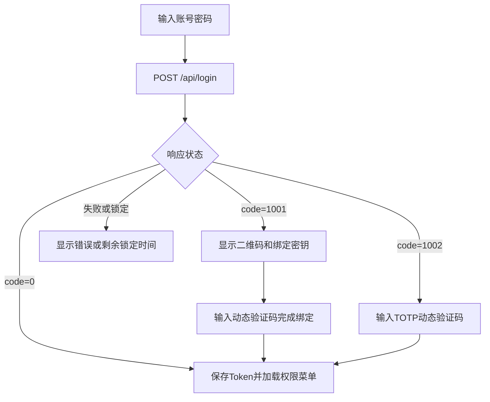
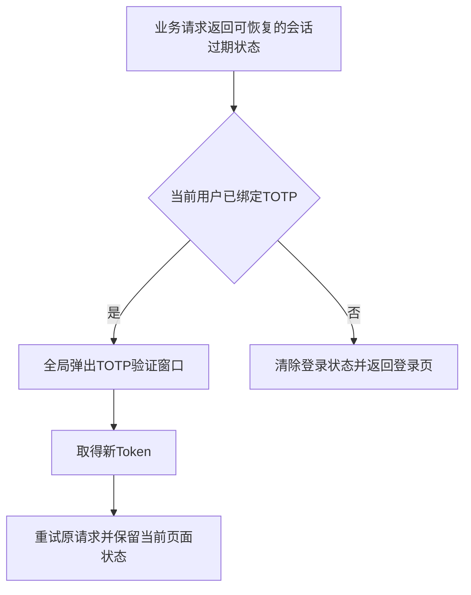
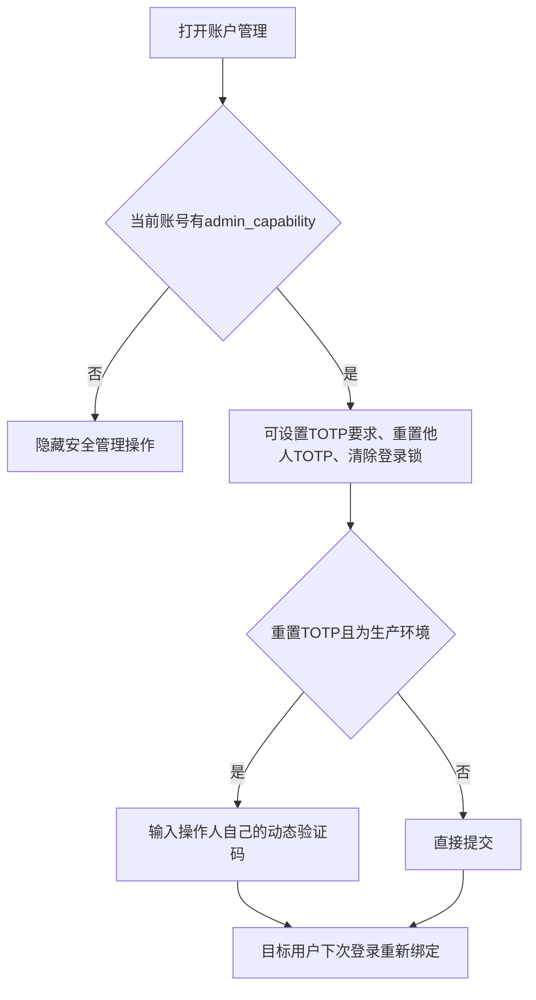
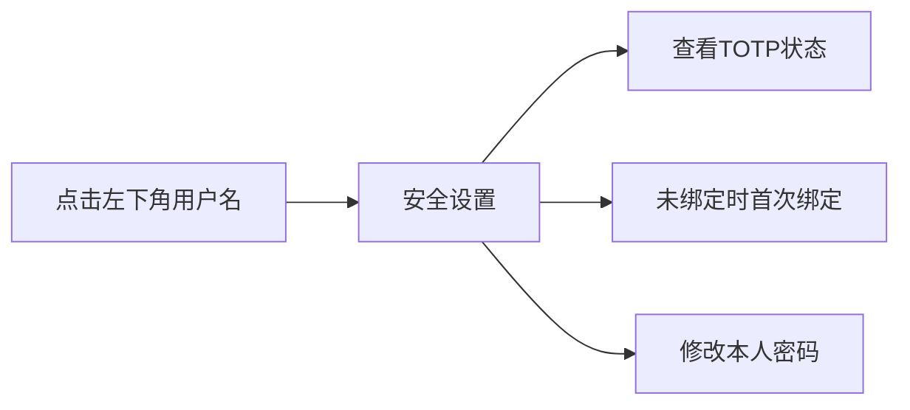

# 系统用户管理业务流程图解

## 登录分流

```mermaid
flowchart TD
    A["输入账号密码"] --> B["POST /api/login"]
    B --> C{"响应状态"}
    C -- "code=0" --> D["保存Token并加载权限菜单"]
    C -- "code=1001" --> E["显示二维码和绑定密钥"]
    E --> F["输入动态验证码完成绑定"]
    F --> D
    C -- "code=1002" --> G["输入TOTP动态验证码"]
    G --> D
    C -- "失败或锁定" --> H["显示错误或剩余锁定时间"]
```

## 会话过期恢复

```mermaid
flowchart TD
    A["业务请求返回可恢复的会话过期状态"] --> B{"当前用户已绑定TOTP"}
    B -- "是" --> C["全局弹出TOTP验证窗口"]
    C --> D["取得新Token"]
    D --> E["重试原请求并保留当前页面状态"]
    B -- "否" --> F["清除登录状态并返回登录页"]
```

## 管理员重置与清锁

```mermaid
flowchart TD
    A["打开账户管理"] --> B{"当前账号有admin_capability"}
    B -- "否" --> C["隐藏安全管理操作"]
    B -- "是" --> D["可设置TOTP要求、重置他人TOTP、清除登录锁"]
    D --> E{"重置TOTP且为生产环境"}
    E -- "是" --> F["输入操作人自己的动态验证码"]
    E -- "否" --> G["直接提交"]
    F --> H["目标用户下次登录重新绑定"]
    G --> H
```

## 本人安全设置

```mermaid
flowchart LR
    A["点击左下角用户名"] --> B["安全设置"]
    B --> C["查看TOTP状态"]
    B --> D["未绑定时首次绑定"]
    B --> E["修改本人密码"]
```
